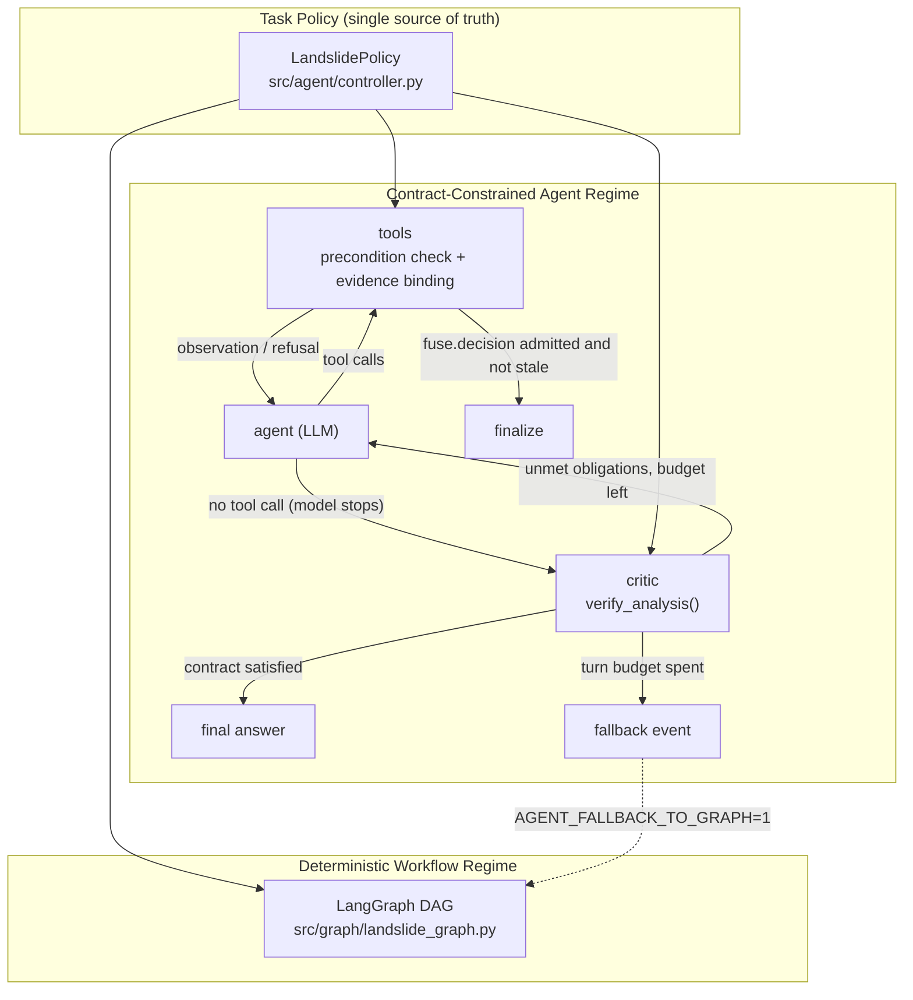

# Methods: A Contract-Constrained Agent for Landslide Interpretation

This document describes the system design of the landslide-analysis agent in
paper terms and maps every component to the code that implements it. It is kept
in step with the code; where the two disagree, the code is authoritative and this
file is out of date.

## 1. Overview

We target **autonomous landslide interpretation from a single remote-sensing
image plus an optional observation coordinate**. The task requires orchestrating
heterogeneous perception and retrieval modules — a vision–language model (VLM)
for scene-level screening and boundary review, a semantic segmentation model, an
image classifier for landslide sub-type, and external geospatial services for
terrain, geology and human-facility context — and fusing their outputs into a
single, evidence-backed determination.

A single declarative **task policy** (`LandslidePolicy`) governs two execution
regimes:

- **Deterministic Workflow Regime** — a fixed LangGraph DAG; reproducible; the
  default for image analysis and the optional fallback of the agent regime.
- **Contract-Constrained Agent Regime** — an LLM controller (ReAct-style)
  chooses every tool, argument, order and iteration, and when to stop. The
  policy constrains it **only through a contract**: per-tool preconditions with
  evidence binding, and a deliverable postcondition checked when the model
  chooses to stop.

Design principle: **free in process, constrained in outcome.** The rule layer
can only *admit or refuse* a call the model requested; it does not select,
reorder, substitute or (with one documented exception, §4.3) execute tools on
the model's behalf, and it gives no step-by-step workflow guidance.

## 2. Formalisation

Let the **evidence ledger** L_t be the map from tool name to its recorded
(non-error) result after step t (`outputs` in the code). For each tool a the
policy defines a precondition Pre_a(L) and an argument-binding rule; the task
defines a postcondition Post(L), returned as a list of unmet obligations.

- **Admissibility.** A call to a at step t executes only if Pre_a(L_t) holds.
  Otherwise the call is refused, the tool does not run, and the refusal is
  returned to the model as an ordinary observation. The model's action space is
  never masked: the full tool catalogue is shown on every turn
  (`_tools_for_model`), in alphabetical order so it does not suggest a workflow
  (`_openai_tools`).
- **Evidence provenance.** For every evidence argument x of a with source tool
  src(x): if x is supplied, it must be consistent with L_t[src(x)], otherwise
  the call is refused; if x is omitted, it is bound to L_t[src(x)]; an argument
  supplied with no recorded source is refused. Request-level constants (image
  path, coordinates, confirmed search radius) are checked the same way against
  the request. Therefore every fused assessment is a function of recorded tool
  outputs, not of values the model copied or invented.
- **Termination.** A run ends successfully only when the model stops and
  Post(L) = ∅, or when `fuse.decision` has been admitted (its precondition
  already implies the evidence part of Post, §4.2) and is not stale. The only
  hard stop is a turn budget T_max; exhausting it yields a `fallback` outcome.

This is Design-by-Contract (pre-/postconditions) applied to a tool-using LLM
agent, with the precondition layer acting as a runtime shield over the
controller's actions.

## 3. Task Policy / Domain-Constraint Layer

**Code:** `src/agent/controller.py` — `LandslidePolicy` (frozen dataclass,
standard library only; built by `from_environment` from
`configs/thresholds.json` plus environment variables). It is imported by
`scripts/llm_service.py`, `src/agent/default_server.py`,
`src/orchestration/agent.py` and `src/graph/landslide_graph.py`. Tuning is
confined to the thresholds file and environment variables.

### 3.1 Tool preconditions and evidence binding

`LandslidePolicy.prepare_tool_call(name, args, outputs, ctx, record=...)` is the
single implementation (used by the agent runtime via
`RuleGuidedAgent._guarded_execute` and by the JSON-RPC registry in
`default_server.py`). It raises `ToolPreconditionError` on refusal and otherwise
returns the bound arguments; `record` receives which arguments were *checked*
and which were *resolved* from the ledger or request. The request context is a
framework-neutral `ToolCallContext`.

| Tool | Precondition (summary) | Bound / checked arguments |
|---|---|---|
| `tiff.info` | image path refers to the image under analysis and is a readable file | `image_path` |
| `llm.first_pass`, `seg.run` | `tiff.info` recorded (common image reference for the initial cross-check) | `image_info` |
| `cls.run`, `image.tile` | image reference matches the scene | `image_info` |
| `seg.refine` | `seg.run` recorded | `segmentation`, `image_info` |
| `region.locate` | `seg.refine` recorded with candidate regions | `refinement`, `image_info` |
| `seg.llm_review` | `seg.refine` recorded with candidate regions | `refinement`, `segmentation`, `stage1`, `image_info` |
| `geo.background`, `geo.nearby` | coordinates available and in valid range | `lat`, `lon` (request constants), `radius` (user-confirmed) |
| `fuse.decision` | `region.locate`* , `llm.first_pass`, `seg.run`, `seg.refine`, `cls.run`, `geo.nearby`, `geo.background` recorded; mandatory re-check done if triggered (§3.2); fusion evidence well-formed (`missing_fusion_requirements`) | `stage1`, `segmentation`, `refinement`, `llm_second_pass`, `classification`, `geo_context` |
| `report.write` | `fuse.decision` recorded; no report written yet (single write); a supplied `report` must equal the recorded assessment | `report`, `out_path` |

\* when `require_region_locate` is on (`AGENT_ENABLE_REGION_LOCATE`, default on).

The helper `_evidence_conflicts` tolerates faithful abbreviations (e.g. rounded
numbers) but refuses contradictions. When a refusal is caused by hand-copied
evidence, the runtime attaches a re-issue template that drops the bound
arguments (`_retry_hint`); the model must still re-issue the call itself.

### 3.2 Confidence-triggered conditional re-perception

`mandatory_second_pass_reason(outputs)` is the single predicate that makes the
VLM boundary re-check `seg.llm_review` a **hard requirement** before fusion. It
fires when:

(a) the refinement/segmentation area ratio is below τ
    (`small_area_ratio_threshold`, default 0.20) — tiny-target case;
(b) first-pass screening reports its own uncertainty
    (`assessment_label ∈ {uncertain, error}`); or
(c) modules disagree (`consistency_needs_second_pass`): screening is negative
    while the segmentation area ratio is ≥ `screening_seg_disagreement_ratio`
    (0.05), or a recorded fusion verdict contradicts the screening verdict — only while
    `enforce_consistency_gate` / `AGENT_CONSISTENCY_GATE` is on.

It is enforced in the `fuse.decision` precondition and in `verify_analysis`,
and is used by the deterministic graph's conditional edge
(`route_second_pass`). There is no UI switch that can suppress it;
`SEG_ENABLE_LLM_SECOND_PASS` can only *add* a description-only pass.
`fuse_decision_is_stale` additionally rejects a fusion computed before a later
`seg.llm_review`, so the fusion must be recomputed.

### 3.3 Fusion decision rule

`LandslidePolicy.fuse_decision(stage1, segmentation, refinement,
llm_second_pass)` is a **symbolic rule**; the LLM does not make the yes/no
verdict directly.

- Inputs to the verdict are only the two detection modalities: whole-image VLM
  screening and semantic segmentation (`seg_is_positive`: area-ratio and
  minimum-pixel thresholds).
- Agreement → the verdict follows directly. Disagreement → the VLM boundary
  re-check is the arbiter (positive only if its score ≥
  `llm_second_pass_threshold`); without a re-check the result is a
  conservative negative.
- `FUSION_REQUIRE_AGREEMENT=0` (`require_modality_agreement`) switches to an
  either-modality OR rule (ablation).
- Sub-type classification and geospatial context are **not** verdict inputs;
  they are required evidence for the report only.
- `confidence` is a score a model emitted — the re-check's score if that pass
  ran as arbiter, else the first-pass score, else `null`
  (`confidence_source` names the origin). It is never synthesised, blended or
  clamped.
- `severity` is an areal-extent band (`severity_medium_area_ratio` 0.05,
  `severity_high_area_ratio` 0.15).

`stage5_fusion.run_stage5` and the graph's fusion node only render around this
result.

### 3.4 Deliverable contract

`verify_analysis(outputs, require_report_write, require_region_locate,
geo_expected)` returns the unmet obligations; an empty list is the definition of
task success. It checks: the initial cross-check (`tiff.info`,
`llm.first_pass`, `seg.run`) succeeded; `cls.run`, `geo.background`,
`geo.nearby` and (if required) `region.locate` produced results; the mandatory
re-check (§3.2) ran when triggered; fusion is present, not stale, and its
evidence is complete; the report was written when required; and, when
coordinates were supplied, geospatial results are not degraded placeholders
(`consistency_violations`).

## 4. Contract-Constrained Agent Regime

**Code:** `src/orchestration/agent.py` — `RuleGuidedAgent` (alias
`AgentRunner` in `agent_runner.py`), a LangGraph state machine with nodes
`agent`, `tools`, `critic`, `finalize`.

### 4.1 What the model sees

- A **non-prescriptive task brief**, `policy.autonomous_task_contract()`,
  injected by `llm_service._inject_forced_system_messages`. It states that there
  is no prescribed workflow, tool quota or call order and lists the kinds of
  evidence that may be relevant.
- A fixed **ReAct preamble** (`react_mode`) on every turn.
- The **full tool catalogue**, alphabetically ordered, with neutral descriptions
  that also state which arguments are bound from recorded results.
- Tool observations. Admitted calls carry a `verification` block
  (`admitted`, `checked`, `resolved`); refused calls carry
  `verification.status = refused` and the reason.

No per-turn "next required step" hint is given. `ordered_workflow_instruction`
and `next_step_hint` still exist in the policy but are not used by the agent
regime (only by the non-agent prompt path).

### 4.2 Control flow

1. `agent` calls the model with the messages and tools.
2. If the reply contains tool calls → `tools`: each call goes through
   `_guarded_execute` → `prepare_tool_call` → registry. After the tools run, if
   `fuse.decision` has succeeded and is not stale → `finalize`; otherwise back
   to `agent`.
3. If the reply contains no tool calls, the model has chosen to stop → `critic`
   runs `verify_analysis`.
   - no violations → final answer (the fused `final_description`, or the
     model's last message);
   - violations and turns < T_max → the obligations are appended as a system
     observation (`format_rule_violations`) and control returns to `agent`;
   - turns ≥ T_max → `fallback`.

The only hard stop is `AGENT_MAX_TURNS` (default 40). `GraphRecursionError` is
also converted into a `fallback` event. The critic never picks or runs a tool;
there is **no deterministic auto-advance**. `AGENT_CRITIC_MAX_RETRIES` is kept
only for labelling and does not trigger fallback.

Because the `fuse.decision` precondition already requires all evidence and the
mandatory re-check, the direct `tools → finalize` path satisfies the evidence
part of the contract without a separate critic visit.

### 4.3 Runtime actions not chosen by the model (disclosed)

- **Report persistence.** When a report write is required, `_persist_report`
  runs `report.write` itself after a successful, non-stale fusion, through the
  same precondition path, and marks it in the trace
  (`invoked_by: runtime`, `execution_state: runtime_persisted`). The step only
  serialises the recorded fusion; it is done by the runtime because the model
  often narrates the report instead of calling the tool.
- **Radius pause.** If the model calls `geo.nearby` before the user has
  confirmed an OSM search radius, the run pauses (`need_nearby_radius`); after
  resuming, the model re-issues the call itself.
- **Loop hygiene** (`loop_hygiene`, a resource control rather than a domain
  rule, held constant across experimental arms): identical calls within a turn
  are served once; successful results of idempotent tools (`_IDEMPOTENT_TOOLS`)
  are reused across turns; remaining calls in a turn are skipped after a
  successful `fuse.decision`. Tool results shown to the model are truncated to
  `AGENT_TOOL_RESULT_CHARS` (default 6000); the ledger keeps the full result.

### 4.4 Fallback

On a `fallback` event the service (`/v1/agent/analyze`,
`/v1/agent/analyze_stream`) runs the deterministic graph only if
`AGENT_FALLBACK_TO_GRAPH=1` (default `0`); the response then has
`mode: "graph"` and `critic.degraded: true`. The fallback event always carries
the ledger, so a failed run can still be scored against the contract.

### 4.5 Scope

The contract applies only to image analysis:
`rule_mode = bool(image_path) and enforce_contract`. Follow-up chat without an
image runs unconstrained.

## 5. Deterministic Workflow Regime

**Code:** `src/graph/landslide_graph.py` (compiled `StateGraph`, typed state,
Pydantic contracts in `src/domain/schemas.py`); public boundary
`src/orchestration/workflow_runner.py`.

Topology: `input → first_pass → segmentation → refinement → region_locate →
[second_pass_review?] → classification → geo_context → fusion → report`. The
conditional edge `route_second_pass` uses the same
`mandatory_second_pass_reason` as the agent. Exposed at `POST /v1/graph/analyze`
and used for image requests unless `agent_mode` is `agent` or `free`.

## 6. Model-Agnostic Tool Protocol Layer

**Code:** `scripts/llm_service.py` — `_extract_tool_calls`,
`_parse_tool_call_body`, `_coerce_tool_args`, and prompt reconstruction in
`chat_completions`.

The controller (Qwen3-VL-8B, optionally with LoRA) is served with
`transformers.generate`, without native tool calling, so a hand-written layer
provides an OpenAI-style tool interface:

- tolerant parsing of tool calls in several surface forms (`<tool_call>{json}`,
  `<function=…>` XML, fenced or bare JSON, stringified arguments, truncated
  output), ignoring empty or nameless calls and de-duplicating within a
  completion;
- reconstruction of previous `tool_calls` and tool-result turns into the next
  prompt;
- a text-only template fallback when `apply_chat_template(tools=...)` is not
  supported.

## 7. Experimental Protocol

### 7.1 Arms

The request field `agent_mode` selects the regime (`llm_service._agent_mode`):

| `agent_mode` | Regime | `enforce_contract` |
|---|---|---|
| `graph` (default) | deterministic workflow | – |
| `agent` | contract-constrained agent | on |
| `free` | unconstrained ReAct agent (ablation) | off |

With the contract off, arguments are passed to tools unchanged, there is no
critic, and a turn without tool calls ends the run (`finalize`); no report is
written on the model's behalf. The two agent arms share the task brief, ReAct
preamble, tool catalogue, tool implementations, `loop_hygiene=True` and
`max_turns`. `scripts/verify_ablation_arms.py` captures the model-facing context
of the first turn for both arms and checks that it is identical, so
`enforce_contract` is the only experimental variable.

### 7.2 Further policy-only ablations

- `AGENT_CONSISTENCY_GATE=0` — removes trigger (c) of §3.2 and the degraded-geo
  check; screening/segmentation disagreement no longer forces a re-check
  (`tests/test_consistency_gate.py`).
- `FUSION_REQUIRE_AGREEMENT=0` — either-modality OR fusion
  (`tests/test_fuse_decision.py`).
- `AGENT_ENABLE_REGION_LOCATE=0`, `AGENT_ENABLE_REPORT_WRITE=0` — drop those
  obligations.

### 7.3 Suggested metrics

Contract satisfaction rate (Post(L) = ∅), fallback rate, detection accuracy /
precision / recall of `has_landslide`, turns and tool calls per run, number of
refused calls and the share of refusals the model recovers from, diversity of
tool orderings across runs (to show that the process is not a fixed pipeline),
and latency.

### 7.4 Status of reported results

Earlier notes reported that the agent completed the full workflow autonomously
in four held-out runs (two scenes, base and LoRA controllers) and that removing
the prior-tool-call reconstruction in §6 made the controller stall after about
two calls. **Those runs used an earlier agent design** (per-turn next-step hints
and deterministic auto-advance, both since removed). They must be re-run under
the current design and on a larger test set before being reported.

Tests covering the contract layer: `tests/test_tool_precondition_guard.py`,
`test_agent_loop_guards.py`, `test_agent_controller.py`,
`test_consistency_gate.py`, `test_fuse_decision.py`,
`test_lazy_nearby_radius.py`, `test_extract_tool_calls.py`.

## 8. Contributions

1. **One task policy shared across regimes.** Preconditions, evidence binding,
   re-perception triggers, the fusion rule and the deliverable contract are
   declared once in `LandslidePolicy` and used by the deterministic graph, the
   agent runtime and the JSON-RPC registry.
2. **Contract-constrained autonomy.** Domain rules act only as preconditions
   and a postcondition on the agent's own actions: no workflow prompt, no
   action masking, no supervisor that picks tools. The rule layer can be turned
   off without changing anything the model sees, which gives a clean ablation.
3. **Provenance-bound tool arguments.** Evidence arguments are verified against
   and bound to recorded tool results, so the final assessment cannot rest on
   evidence the model fabricated or mis-copied.
4. **Confidence-triggered re-perception.** A VLM boundary re-check is required
   for tiny targets, self-reported screening uncertainty and cross-modality
   disagreement, and the fusion rule uses it as the arbiter.

## 9. Limitations

- The yes/no verdict is a symbolic rule over two modalities; the LLM plans the
  investigation and supplies screening and re-check judgements, but does not
  make the final decision on its own.
- `report.write` may be executed by the runtime (§4.3), which is an exception to
  "the rule layer never executes tools".
- The contract only covers image-analysis requests (§4.5).
- Fallback to the deterministic graph is off by default, so a failed agent run
  returns no graph result unless it is enabled.
- The local `transformers.generate` stack and its hand-written tool protocol are
  the main source of fragility. Replacing it with vLLM / SGLang native tool
  calling would not affect the orchestration or policy layers.
- Quantitative results are pending (§7.4).
